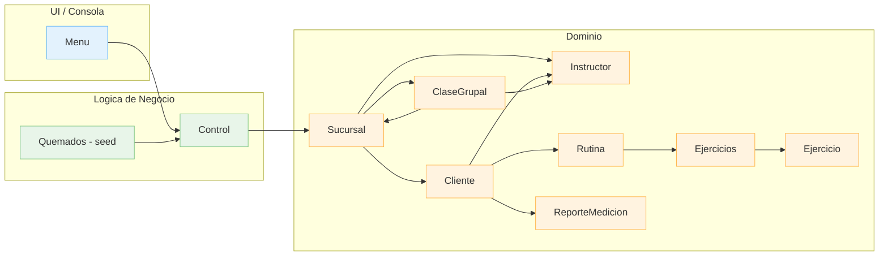
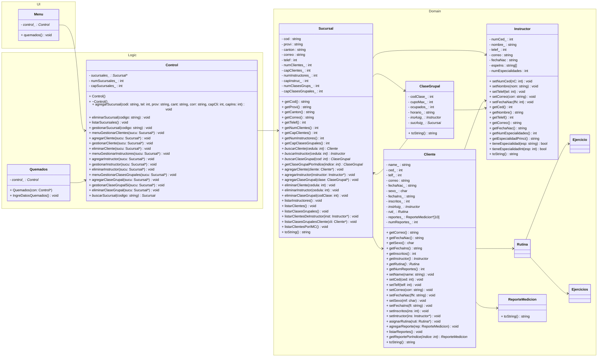

Notas rápidas:
- Menu dirige las acciones del usuario hacia Control.
- Quemados carga datos de ejemplo en Control.
- Control orquesta Sucursal y sus entidades relacionadas (Cliente, Instructor, ClaseGrupal).
- Cliente referencia a su Instructor, a una Rutina y a sus ReporteMedicion.
- ClaseGrupal se asocia a Instructor y Sucursal.
- Rutina agrega Ejercicios/Ejercicio.

---

## 2) UML de Clases (Mermaid)

---
