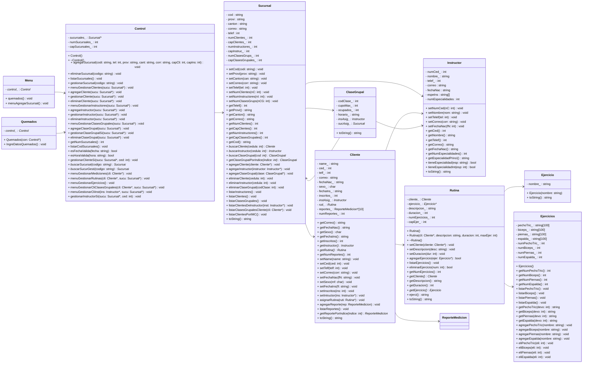

```mermaid
classDiagram
  direction LR

  %% UI
  class Menu {
    - control_ : Control*
    + quemados() void
    + menuAgregarSucursal() void
  }

  %% Logica
  class Control {
    - sucursales_ : Sucursal**
    - numSucursales_ : int
    - capSucursales_ : int
    + Control()
    + ~Control()
    + agregarSucursal(codi: string, tel: int, prov: string, cant: string, corr: string, capCli: int, capIns: int) void
    + eliminarSucursal(codigo: string) void
    + listarSucursales() void
    + gestionarSucursal(codigo: string) void
    + menuGestionarClientes(sucu: Sucursal*) void
    + agregarCliente(sucu: Sucursal*) void
    + gestionarCliente(sucu: Sucursal*) void
    + eliminarCliente(sucu: Sucursal*) void
    + menuGestionarInstructores(sucu: Sucursal*) void
    + agregarInstructor(sucu: Sucursal*) void
    + gestionarInstructor(sucu: Sucursal*) void
    + eliminarInstructor(sucu: Sucursal*) void
    + menuGestionarClasesGrupales(sucu: Sucursal*) void
    + agregarClaseGrupal(sucu: Sucursal*) void
    + gestionarClaseGrupalSi(sucu: Sucursal*) void
    + eliminarClaseGrupal(sucu: Sucursal*) void
    + getNumSucursales() int
    + listarCodSucursales() void
    + esFechaValida(fecha: string) bool
    + esHoraValida(hora: string) bool
    + gestionarClienteSi(sucu: Sucursal*, ced: int) void
    + buscarSucursal(codigo: string) Sucursal*
    + buscarSucurGesti(codigo: string) Sucursal*
    + menuGestionarMediciones(cli: Cliente*) void
    + menuGestionarRutinas(cli: Cliente*, sucu: Sucursal*) void
    + menuGestionarEjercicios() void
    + menuGestionarCliClasesGrupales(cli: Cliente*, sucu: Sucursal*) void
    + menuGestionarCliInst(ins: Instructor*, sucu: Sucursal*) void
    + gestionarInstructorSi(sucu: Sucursal*, ced: int) void
  }

  class Quemados {
    - control_ : Control*
    + Quemados(con: Control*)
    + IngreDatosQuemados() void
  }

  %% Dominio
  class Sucursal {
    - cod : string
    - provi : string
    - canton : string
    - correo : string
    - telef : int
    - numClientes_ : int
    - capClientes_ : int
    - numInstructores_ : int
    - capInstruc_ : int
    - numClasesGrups_ : int
    - capClasesGrupales_ : int
    + setCod(codi: string) void
    + setProvi(prov: string) void
    + setCanton(can: string) void
    + setCorreo(corr: string) void
    + setTelef(tel: int) void
    + setNumClientes(nC: int) void
    + setNumInstructores(nI: int) void
    + setNumClasesGrups(nCG: int) void
    + getTelef() int
    + getProvi() string
    + getCanton() string
    + getCorreo() string
    + getNumClientes() int
    + getCapClientes() int
    + getNumInstructores() int
    + getCapClasesGrupales() int
    + getCod() string
    + buscarCliente(cedula: int) Cliente*
    + buscarInstructor(cedula: int) Instructor*
    + buscarClaseGrupal(cod: int) ClaseGrupal*
    + getClaseGrupalPorIndice(indice: int) ClaseGrupal*
    + agregarCliente(cliente: Cliente*) void
    + agregarInstructor(instructor: Instructor*) void
    + agregarClaseGrupal(clase: ClaseGrupal*) void
    + eliminarCliente(cedula: int) void
    + eliminarInstructor(cedula: int) void
    + eliminarClaseGrupal(codClase: int) void
    + listarInstructores() void
    + listarClientes() void
    + listarClasesGrupales() void
    + listarClientesDeInstructor(inst: Instructor*) void
    + listarClasesGrupalesCliente(cli: Cliente*) void
    + listarClientesPorIMC() void
    + toString() string
  }

  class Cliente {
    - name_ : string
    - ced_ : int
    - telf_ : int
    - correo : string
    - fechaNac_ : string
    - sexo_ : char
    - fechaIns_ : string
    - inscritos_ : int
    - instAsig_ : Instructor*
    - ruti_ : Rutina*
    - reportes_ : ReporteMedicion*[10]
    - numReportes_ : int
    + getCorreo() string
    + getFechaNac() string
    + getSexo() char
    + getFechaIns() string
    + getInscritos() int
    + getInstructor() Instructor*
    + getRutina() Rutina*
    + getNumReportes() int
    + setName(name: string) void
    + setCed(ced: int) void
    + setTelf(telf: int) void
    + setCorreo(corr: string) void
    + setFechaNac(fN: string) void
    + setSexo(mf: char) void
    + setFechaIns(fI: string) void
    + setInscritos(ins: int) void
    + setIntructor(ins: Instructor*) void
    + asignarRutina(ruti: Rutina*) void
    + agregarReporte(rep: ReporteMedicion) void
    + listarReportes() void
    + getReportePorIndice(indice: int) ReporteMedicion*
    + toString() string
  }

  class Instructor {
    - numCed_ : int
    - nombre_ : string
    - telef_ : int
    - correo : string
    - fechaNac : string
    - espeIns : string[]
    - numEspecialidades : int
    + setNumCed(nC: int) void
    + setNombre(nom: string) void
    + setTelef(tel: int) void
    + setCorreo(corr: string) void
    + setFechaNac(fN: int) void
    + getCed() int
    + getNombre() string
    + getTelef() int
    + getCorreo() string
    + getFechaNac() string
    + getNumEspecialidades() int
    + getEspecialidadPrinci() string
    + tieneEspecialidad(esp: string) bool
    + tieneEspecialidadInt(esp: int) bool
    + toString() string
  }

  class ClaseGrupal {
    - codClase_ : int
    - cupoMax_ : int
    - ocupados_ : int
    - horario_ : string
    - insAsig_ : Instructor*
    - sucAsig_ : Sucursal*
    + toString() string
  }

  %% COMPLETAMOS: Rutina, Ejercicios y Ejercicio
  class Rutina {
    - cliente_ : Cliente*
    - ejercicio_ : Ejercicio**
    - descripcion_ : string
    - duracion_ : int
    - numEjercicios_ : int
    - capEjer_ : int
    + Rutina()
    + Rutina(cli: Cliente*, descripcion: string, duracion: int, maxEjer: int)
    + ~Rutina()
    + setCliente(cliente: Cliente*) void
    + setDescripcion(desc: string) void
    + setDuracion(dur: int) void
    + agregarEjercicio(ejer: Ejercicio*) bool
    + listarEjercicios() void
    + eliminarEjercicio(num: int) bool
    + getNumEjercicios() int
    + getCliente() Cliente*
    + getDescripcion() string
    + getDuracion() int
    + getEjercicio() Ejercicio*
    + ejerci() string
    + toString() string
  }

  class Ejercicios {
    - pechoTric_ : string[100]
    - biceps_ : string[100]
    - piernas_ : string[100]
    - espalda_ : string[100]
    - numPechoTric_ : int
    - numBiceps_ : int
    - numPiernas_ : int
    - numEspalda_ : int
    + Ejercicios()
    + getNumPechoTric() int
    + getNumBiceps() int
    + getNumPiernas() int
    + getNumEspalda() int
    + listarPechoTric() void
    + listarBiceps() void
    + listarPiernas() void
    + listarEspalda() void
    + getPechoTric(devo: int) string
    + getBiceps(devo: int) string
    + getPiernas(devo: int) string
    + getEspalda(devo: int) string
    + agregarPechoTric(nombre: string) void
    + agregarBiceps(nombre: string) void
    + agregarPiernas(nombre: string) void
    + agregarEspalda(nombre: string) void
    + eliPechoTric(eli: int) void
    + eliBiceps(eli: int) void
    + eliPiernas(eli: int) void
    + eliEspalda(eli: int) void
  }

  class Ejercicio {
    - nombre_ : string
    + Ejercicio(nombre: string)
    + toString() string
  }

  %% Relaciones
  Control --> Sucursal
  Sucursal --> Cliente
  Sucursal --> Instructor
  Sucursal --> ClaseGrupal
  Cliente --> Instructor
  Cliente --> Rutina
  Cliente --> ReporteMedicion
  ClaseGrupal --> Instructor
  ClaseGrupal --> Sucursal
  Menu --> Control
  Quemados --> Control
  Rutina --> Ejercicio
  Rutina --> Ejercicios
```

---
