```mermaid
graph TD
  subgraph "UI (Consola)"
    Menu[Menu]
  end

  subgraph "Lógica de Negocio"
    Control[Control]
    Quemados[Quemados (seed de datos)]
  end

  subgraph "Dominio"
    Sucursal[Sucursal]
    Cliente[Cliente]
    Instructor[Instructor]
    ClaseGrupal[ClaseGrupal]
    Rutina[Rutina]
    ReporteMedicion[ReporteMedicion]
    Ejercicios[Ejercicios]
    Ejercicio[Ejercicio]
  end

  %% Flujos principales
  Menu --> Control
  Quemados --> Control

  Control --> Sucursal
  Sucursal --> Cliente
  Sucursal --> Instructor
  Sucursal --> ClaseGrupal

  Cliente --> Instructor
  Cliente --> Rutina
  Cliente --> ReporteMedicion

  ClaseGrupal --> Instructor
  ClaseGrupal --> Sucursal

  Rutina --> Ejercicios
  Ejercicios --> Ejercicio
```

Notas:
- `Menu` interactúa con el usuario por consola y delega la lógica en `Control`.
- `Quemados` sirve para cargar datos predeterminados y también depende de `Control`.
- `Control` orquesta la gestión de `Sucursal` y, por tanto, de `Cliente`, `Instructor` y `ClaseGrupal`.
- `Cliente` mantiene referencia a su `Instructor`, a una `Rutina`, y a un conjunto acotado de `ReporteMedicion`.
- `ClaseGrupal` puede tener un `Instructor` y estar asociada a una `Sucursal`.
- `Rutina` se compone de `Ejercicios`/`Ejercicio`.

---

## 2) UML de Clases (Mermaid)

```mermaid
classDiagram
  class Control {
    - Sucursal** sucursales_
    - int numSucursales_
    - int capSucursales_
    + Control()
    + ~Control()
    + agregarSucursal(codi: string, tel: int, prov: string, cant: string, corr: string, capCli: int, capIns: int) void
    + eliminarSucursal(codigo: string) void
    + listarSucursales() void
    + gestionarSucursal(codigo: string) void
    + menuGestionarClientes(sucu: Sucursal*) void
    + agregarCliente(sucu: Sucursal*) void
    + gestionarCliente(sucu: Sucursal*) void
    + eliminarCliente(sucu: Sucursal*) void
    + menuGestionarInstructores(sucu: Sucursal*) void
    + agregarInstructor(sucu: Sucursal*) void
    + gestionarInstructor(sucu: Sucursal*) void
    + eliminarInstructor(sucu: Sucursal*) void
    + menuGestionarClasesGrupales(sucu: Sucursal*) void
    + agregarClaseGrupal(sucu: Sucursal*) void
    + gestionarClaseGrupalSi(sucu: Sucursal*) void
    + eliminarClaseGrupal(sucu: Sucursal*) void
    + buscarSucursal(codigo: string) Sucursal*
  }

  class Sucursal {
    - string cod
    - string provi
    - string canton
    - string correo
    - int telef
    - int numClientes_
    - int capClientes_
    - int numInstructores_
    - int capInstruc_
    - int numClasesGrups_
    - int capClasesGrupales_
    + getCod() string
    + getProvi() string
    + getCanton() string
    + getCorreo() string
    + getTelef() int
    + getNumClientes() int
    + getCapClientes() int
    + getNumInstructores() int
    + getCapClasesGrupales() int
    + buscarCliente(cedula: int) Cliente*
    + buscarInstructor(cedula: int) Instructor*
    + buscarClaseGrupal(cod: int) ClaseGrupal*
    + getClaseGrupalPorIndice(indice: int) ClaseGrupal*
    + agregarCliente(cliente: Cliente*) void
    + agregarInstructor(instructor: Instructor*) void
    + agregarClaseGrupal(clase: ClaseGrupal*) void
    + eliminarCliente(cedula: int) void
    + eliminarInstructor(cedula: int) void
    + eliminarClaseGrupal(codClase: int) void
    + listarInstructores() void
    + listarClientes() void
    + listarClasesGrupales() void
    + listarClientesDeInstructor(inst: Instructor*) void
    + listarClasesGrupalesCliente(cli: Cliente*) void
    + listarClientesPorIMC() void
    + toString() string
  }

  class Cliente {
    - string name_
    - int ced_
    - int telf_
    - string correo
    - string fechaNac_
    - char sexo_
    - string fechaIns_
    - int inscritos_
    - Instructor* instAsig_
    - Rutina* ruti_
    - ReporteMedicion* reportes_[10]
    - int numReportes_
    + getCorreo() string
    + getFechaNac() string
    + getSexo() char
    + getFechaIns() string
    + getInscritos() int
    + getInstructor() Instructor*
    + getRutina() Rutina*
    + getNumReportes() int
    + setName(name: string) void
    + setCed(ced: int) void
    + setTelf(telf: int) void
    + setCorreo(corr: string) void
    + setFechaNac(fN: string) void
    + setSexo(mf: char) void
    + setFechaIns(fI: string) void
    + setInscritos(ins: int) void
    + setIntructor(ins: Instructor*) void
    + asignarRutina(ruti: Rutina*) void
    + agregarReporte(rep: ReporteMedicion const&) void
    + listarReportes() void
    + getReportePorIndice(indice: int) ReporteMedicion*
    + toString() string
  }

  class Instructor {
    - int numCed_
    - string nombre_
    - int telef_
    - string correo
    - string fechaNac
    - string espeIns[*]
    - int numEspecialidades
    + setNumCed(nC: int) void
    + setNombre(nom: string) void
    + setTelef(tel: int) void
    + setCorreo(corr: string) void
    + setFechaNac(fN: int) void
    + getCed() int
    + getNombre() string
    + getTelef() int
    + getCorreo() string
    + getFechaNac() string
    + getNumEspecialidades() int
    + getEspecialidadPrinci() string
    + tieneEspecialidad(esp: string&) bool
    + tieneEspecialidadInt(esp: int) bool
    + toString() string
  }

  class ClaseGrupal {
    - int codClase_
    - int cupoMax_
    - int ocupados_
    - string horario_
    - Instructor* insAsig_
    - Sucursal* sucAsig_
    + toString() string
  }

  class Quemados {
    - Control* control_
    + Quemados(con: Control*)
    + IngreDatosQuemados() void
  }

  class Menu {
    - Control* control_
    + quemados() void
    + menuAgregarSucursal() void
  }

  class Rutina
  class Ejercicio
  class Ejercicios
  class ReporteMedicion {
    + toString() string
  }

  %% Relaciones
  Control "1" --> "*" Sucursal
  Sucursal "1" --> "*" Cliente
  Sucursal "1" --> "*" Instructor
  Sucursal "1" --> "*" ClaseGrupal
  Cliente "0..1" --> "1" Instructor
  Cliente "0..1" --> "1" Rutina
  Cliente "0..10" --> "1" ReporteMedicion
  ClaseGrupal "0..1" --> "1" Instructor
  ClaseGrupal "0..1" --> "1" Sucursal
  Menu --> Control
  Quemados --> Control
  Rutina --> "0..*" Ejercicio
  Rutina --> Ejercicios
  ReporteMedicion --> Cliente
```



---
