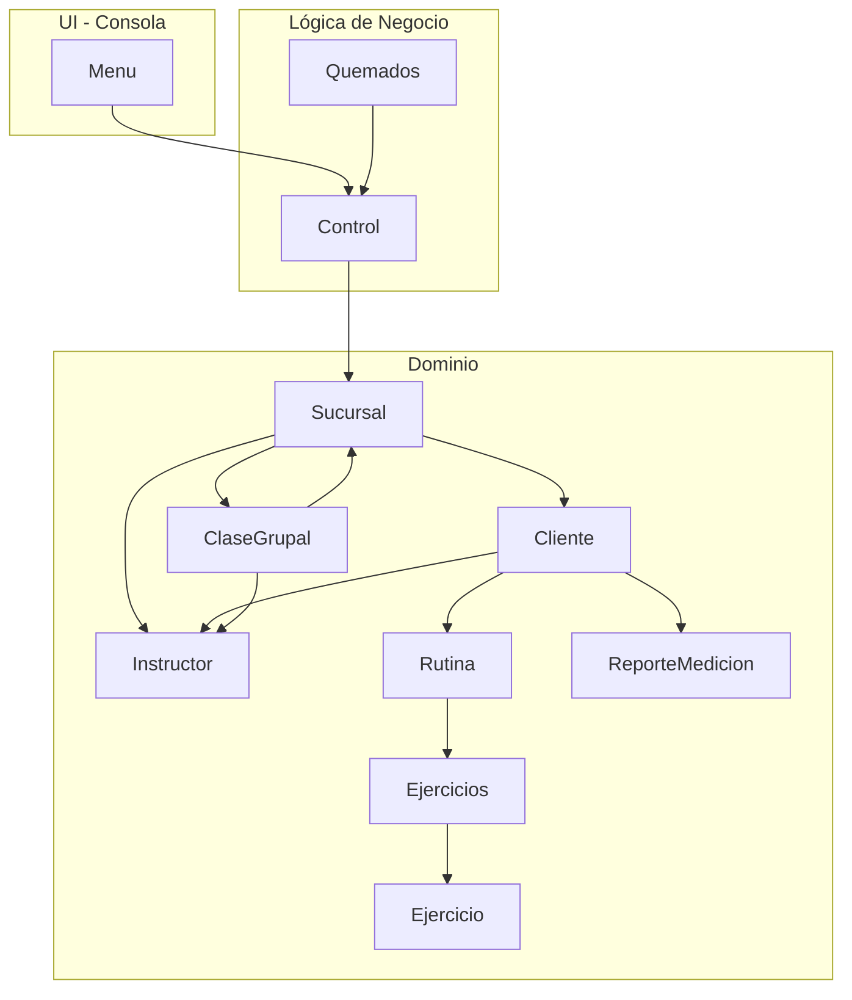

Notas:
- Menu interactúa con el usuario por consola y delega la lógica en Control.
- Quemados sirve para cargar datos predeterminados y también depende de Control.
- Control orquesta la gestión de Sucursal y, por tanto, de Cliente, Instructor y ClaseGrupal.
- Cliente mantiene referencia a su Instructor, a una Rutina, y a un conjunto acotado de ReporteMedicion.
- ClaseGrupal puede tener un Instructor y estar asociada a una Sucursal.
- Rutina se compone de Ejercicios/Ejercicio.

---

## 2) UML de Clases (Mermaid)

```mermaid
classDiagram
  class Control {
    - sucursales_ : Sucursal**
    - numSucursales_ : int
    - capSucursales_ : int
    + Control()
    + ~Control()
    + agregarSucursal(codi: string, tel: int, prov: string, cant: string, corr: string, capCli: int, capIns: int) void
    + eliminarSucursal(codigo: string) void
    + listarSucursales() void
    + gestionarSucursal(codigo: string) void
    + menuGestionarClientes(sucu: Sucursal*) void
    + agregarCliente(sucu: Sucursal*) void
    + gestionarCliente(sucu: Sucursal*) void
    + eliminarCliente(sucu: Sucursal*) void
    + menuGestionarInstructores(sucu: Sucursal*) void
    + agregarInstructor(sucu: Sucursal*) void
    + gestionarInstructor(sucu: Sucursal*) void
    + eliminarInstructor(sucu: Sucursal*) void
    + menuGestionarClasesGrupales(sucu: Sucursal*) void
    + agregarClaseGrupal(sucu: Sucursal*) void
    + gestionarClaseGrupalSi(sucu: Sucursal*) void
    + eliminarClaseGrupal(sucu: Sucursal*) void
    + buscarSucursal(codigo: string) Sucursal*
  }

  class Sucursal {
    - cod : string
    - provi : string
    - canton : string
    - correo : string
    - telef : int
    - numClientes_ : int
    - capClientes_ : int
    - numInstructores_ : int
    - capInstruc_ : int
    - numClasesGrups_ : int
    - capClasesGrupales_ : int
    + getCod() string
    + getProvi() string
    + getCanton() string
    + getCorreo() string
    + getTelef() int
    + getNumClientes() int
    + getCapClientes() int
    + getNumInstructores() int
    + getCapClasesGrupales() int
    + buscarCliente(cedula: int) Cliente*
    + buscarInstructor(cedula: int) Instructor*
    + buscarClaseGrupal(cod: int) ClaseGrupal*
    + getClaseGrupalPorIndice(indice: int) ClaseGrupal*
    + agregarCliente(cliente: Cliente*) void
    + agregarInstructor(instructor: Instructor*) void
    + agregarClaseGrupal(clase: ClaseGrupal*) void
    + eliminarCliente(cedula: int) void
    + eliminarInstructor(cedula: int) void
    + eliminarClaseGrupal(codClase: int) void
    + listarInstructores() void
    + listarClientes() void
    + listarClasesGrupales() void
    + listarClientesDeInstructor(inst: Instructor*) void
    + listarClasesGrupalesCliente(cli: Cliente*) void
    + listarClientesPorIMC() void
    + toString() string
  }

  class Cliente {
    - name_ : string
    - ced_ : int
    - telf_ : int
    - correo : string
    - fechaNac_ : string
    - sexo_ : char
    - fechaIns_ : string
    - inscritos_ : int
    - instAsig_ : Instructor*
    - ruti_ : Rutina*
    - reportes_ : ReporteMedicion*[]
    - numReportes_ : int
    + getCorreo() string
    + getFechaNac() string
    + getSexo() char
    + getFechaIns() string
    + getInscritos() int
    + getInstructor() Instructor*
    + getRutina() Rutina*
    + getNumReportes() int
    + setName(name: string) void
    + setCed(ced: int) void
    + setTelf(telf: int) void
    + setCorreo(corr: string) void
    + setFechaNac(fN: string) void
    + setSexo(mf: char) void
    + setFechaIns(fI: string) void
    + setInscritos(ins: int) void
    + setIntructor(ins: Instructor*) void
    + asignarRutina(ruti: Rutina*) void
    + agregarReporte(rep: ReporteMedicion) void
    + listarReportes() void
    + getReportePorIndice(indice: int) ReporteMedicion*
    + toString() string
  }

  class Instructor {
    - numCed_ : int
    - nombre_ : string
    - telef_ : int
    - correo : string
    - fechaNac : string
    - espeIns : string[]
    - numEspecialidades : int
    + setNumCed(nC: int) void
    + setNombre(nom: string) void
    + setTelef(tel: int) void
    + setCorreo(corr: string) void
    + setFechaNac(fN: int) void
    + getCed() int
    + getNombre() string
    + getTelef() int
    + getCorreo() string
    + getFechaNac() string
    + getNumEspecialidades() int
    + getEspecialidadPrinci() string
    + tieneEspecialidad(esp: string) bool
    + tieneEspecialidadInt(esp: int) bool
    + toString() string
  }

  class ClaseGrupal {
    - codClase_ : int
    - cupoMax_ : int
    - ocupados_ : int
    - horario_ : string
    - insAsig_ : Instructor*
    - sucAsig_ : Sucursal*
    + toString() string
  }

  class Quemados {
    - control_ : Control*
    + Quemados(con: Control*)
    + IngreDatosQuemados() void
  }

  class Menu {
    - control_ : Control*
    + quemados() void
  }

  class Rutina
  class Ejercicio
  class Ejercicios
  class ReporteMedicion {
    + toString() string
  }

  Control --> Sucursal
  Sucursal --> Cliente
  Sucursal --> Instructor
  Sucursal --> ClaseGrupal
  Cliente --> Instructor
  Cliente --> Rutina
  Cliente --> ReporteMedicion
  ClaseGrupal --> Instructor
  ClaseGrupal --> Sucursal
  Menu --> Control
  Quemados --> Control
  Rutina --> Ejercicio
  Rutina --> Ejercicios
```

---
